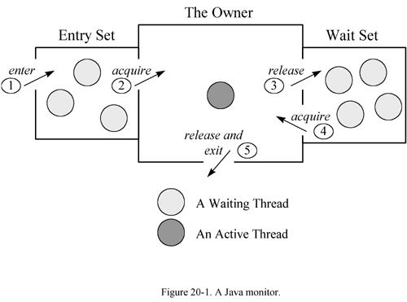

# 0. How to get an Object?
## 0.1 Three ways of creating an Object？
### 0.1.1 new Constructor()
### 0.2.2 Unsafe.allocateIntance(Class)
> [参考代码](https://github.com/soyona/condor/tree/master/basic-sample-jcu/basic-sample-jcu-unsafe#31-create-an-instance-of-a-class-without-calling-a-constructor)
```text
 Order order = (Order)UnsafeUtils.unsafe.allocateInstance(Order.class);
```
> [参考Kyro实例化](../basic-sample-serializable/basic-sample-serializable-kryo/README.md)
### 0.2.3 反序列化
> [参考各种序列化手段](https://github.com/soyona/condor/tree/master/basic-sample-serializable)

### 0.2.4 objenesis
> [objenesis](https://blog.csdn.net/codershamo/article/details/52015206)
```text
不使用构造器创建对象
```
# 1. How to Computing an object's size
> [StackOverFlow Discuss](https://stackoverflow.com/questions/52353/in-java-what-is-the-best-way-to-determine-the-size-of-an-object)

# 2. Java Object在内存中的布局
> 对象头、实例数据、对齐填充
## 2.1 Object's Head structure
> [source code markOop.hpp](http://hg.openjdk.java.net/jdk8/jdk8/hotspot/file/87ee5ee27509/src/share/vm/oops/markOop.hpp)
 
> [Object's Header](https://wiki.openjdk.java.net/download/attachments/11829266/Synchronization.gif?version=4&modificationDate=1208918680000&api=v2)
```text
The structure of the object header is defined in the classes oopDesc and markOopDesc, 
the code for thin locks is integrated in the interpreter and compilers, and the class ObjectMonitor represents inflated locks. 
Biased locking is centralized in the class BiasedLocking. It can be enabled via the flag -XX:+UseBiasedLocking and disabled via -XX:-UseBiasedLocking.
 It is enabled by default for Java 6 and Java 7, but activated only some seconds after the application startup. 
Therefore, beware of short-running micro-benchmarks. If necessary, turn off the delay using the flag -XX:BiasedLockingStartupDelay=0.
```
> 


> 01->00 
```text
As long as an object is unlocked,the last two bits have the value 01.
When a method synchronizes on an object,
the header word and a pointer to the object are stored in a lock record within the current stack frame.
Then the VM attempts to install a pointer to the lock record in the object's header word via a compare-and-swap operation.
If it succeeds,the current thread aferwards owns the lock,
Since lock records are always aligned at word boundaries,
the last two bits of the header word are then 00 and identify the object as being locked.
```
```text
If the compare-and-swap operation fails because the object was locked before, 
the VM first tests whether the header word points into the method stack of the current thread. 
In this case, the thread already owns the object's lock and can safely continue its execution.
For such a recursively locked object, the lock record is initialized with 0 instead of the object's header word. 
Only if two different threads concurrently synchronize on the same object, 
the thin lock must be inflated to a heavyweight monitor for the management of waiting threads.
```
```text
The mark word has word size (4 byte on 32 bit architectures, 8 byte on 64 bit architectures) and
```
### 2.1.2 class pointer
```text
klass pointer has word size on 32 bit architectures. On 64 bit architectures the klass pointer either has word size, but can also have 4 byte 
if the heap addresses can be encoded in these 4 bytes.
```
## 2.2 实例数据
> 存放类的属性信息，包括父类属性信息，如果是数组还包括数组长度，这部分按照4个字节对齐
## 2.3 对齐填充
> 由于JVM要求对象的起始地址必须是8的整数倍，必须填充补齐


# 3. ObjectMonitor
```text
Monitor(管程，也称为监视器) 是一种程序结构，结构内的多个子程序形成的多个工作线程互斥访问共享资源，管程实现了在一个时间点，
只能有一个线程访问共享资源。

``` 
>  [ObjectMonitor](https://github.com/openjdk-mirror/jdk7u-hotspot/blob/50bdefc3afe944ca74c3093e7448d6b889cd20d1/src/share/vm/runtime/objectMonitor.cpp)

```text
 ObjectMonitor() {
    _header       = NULL;
    _count        = 0; // 用来记录该线程获取锁的次数
    _waiters      = 0,
    _recursions   = 0; // 锁的重入次数
    _object       = NULL;
    _owner        = NULL; // 指向持有ObjectMonitor对象的线程
    _WaitSet      = NULL; // 存放持有wait状态的线程队列
    _WaitSetLock  = 0 ;
    _Responsible  = NULL ;
    _succ         = NULL ;
    _cxq          = NULL ;
    FreeNext      = NULL ;
    _EntryList    = NULL ; // 存放处于等待锁block状态的线程队列
    _SpinFreq     = 0 ;
    _SpinClock    = 0 ;
    OwnerIsThread = 0 ;
  }
```
> Java Monitor Figure



## 3.1 ObjectWaiter
```text
ObjectWaiter是一个双向链表,每一个等待锁的线程都被封装为一个ObjectWaiter对象，
```
```text
class ObjectWaiter : public StackObj {  
 public:  
  enum TStates { TS_UNDEF, TS_READY, TS_RUN, TS_WAIT, TS_ENTER, TS_CXQ } ;  
  enum Sorted  { PREPEND, APPEND, SORTED } ;  
  ObjectWaiter * volatile _next;  
  ObjectWaiter * volatile _prev;  
  Thread*       _thread;  
  ParkEvent *   _event;  
  volatile int  _notified ;  
  volatile TStates TState ;  
  Sorted        _Sorted ;           // List placement disposition  
  bool          _active ;           // Contention monitoring is enabled  
 public:  
  ObjectWaiter(Thread* thread) {  
    _next     = NULL;  
    _prev     = NULL;  
    _notified = 0;  
    TState    = TS_RUN ;  
    _thread   = thread;  
    _event    = thread->_ParkEvent ;  
    _active   = false;  
    assert (_event != NULL, "invariant") ;  
  }  
  void wait_reenter_begin(ObjectMonitor *mon) {  
    JavaThread *jt = (JavaThread *)this->_thread;  
    _active = JavaThreadBlockedOnMonitorEnterState::wait_reenter_begin(jt, mon);  
  }  
  void wait_reenter_end(ObjectMonitor *mon) {  
    JavaThread *jt = (JavaThread *)this->_thread;  
    JavaThreadBlockedOnMonitorEnterState::wait_reenter_end(jt, _active);  
  }  
};  
```
## 3.1.2 Object.wait
> Object.wait方法最终调用ObjectMonitor.wait(jlong millis, bool interruptable, TRAPS)方法实现：[具体实现](https://github.com/openjdk-mirror/jdk7u-hotspot/blob/50bdefc3afe944ca74c3093e7448d6b889cd20d1/src/share/vm/runtime/objectMonitor.cpp)
 
>> ObjectWaiter node(self)  创建ObjectWaiter节点加入队列
 
>> ObjectMonitor::AddWaiter 方法将node添加到_WaitSet列表中
 
>> ObjectMonitor::exit 释放当前的ObjectMonitor对象
 
>> The thread is on the WaitSet list - now park() it,java_suspend_self();

## 3.1.3 Object.notify
> Object.notify调用ObjectMonitor的void ObjectMonitor::notify(TRAPS)，[具体实现](https://github.com/openjdk-mirror/jdk7u-hotspot/blob/50bdefc3afe944ca74c3093e7448d6b889cd20d1/src/share/vm/runtime/objectMonitor.cpp)
 
>> if _WaitSet == NULL 返回
```text
if (_WaitSet == NULL) {
      TEVENT (Empty-NotifyAll) ;
      return ;
  }
```
 
>> not null,ObjectMonitor::DequeueWaiter 获取_WaitSet中的要唤醒的ObjectWaiter对象，根据不同策略加入_EntryList队列
```text
ObjectWaiter * iterator = DequeueWaiter() ;
```
```text
if (List == NULL) {
     iterator->_next = iterator->_prev = NULL ;
     _EntryList = iterator ;
 } else {
     List->_prev = iterator ;
     iterator->_next = List ;
     iterator->_prev = NULL ;
     _EntryList = iterator ;
}
```

## 3.1.4 Object.notfyAll
> Object.notfyAll调用ObjectMonitor的void ObjectMonitor::notifyAll(TRAPS)，[具体实现](https://github.com/openjdk-mirror/jdk7u-hotspot/blob/50bdefc3afe944ca74c3093e7448d6b889cd20d1/src/share/vm/runtime/objectMonitor.cpp)
 
>> for(;;){iterator = DequeueWaiter () ;}根据不同策略加入_EntryList队列