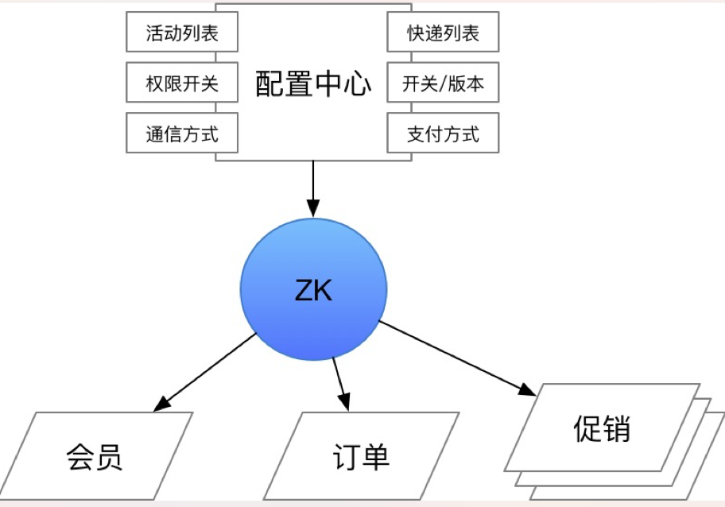

# 1. Zookeeper
> [Apache Zookeeper](http://zookeeper.apache.org/)
```text
Zookeeper是开源的分布式协调服务。
```
# 2. Zookeeper数据模型
# 3. Zookeeper协议
# 4. Zookeeper集群
## 4.1 集群角色
### 4.1.1 Leader
### 4.1.2 Follower
### 4.1.3 Observer
## 4.2 集群节点通信
## 4.3 选主


# 5. Zookeeper使用场景
## 5.1 配置管理中心
```text
实现动态配置，即时生效，不用重启服务
```
> 架构设计

 
> [案例](https://blog.csdn.net/u011320740/article/details/78742625)
```text

```
## 5.2 服务注册中心
## 5.3 分布式锁